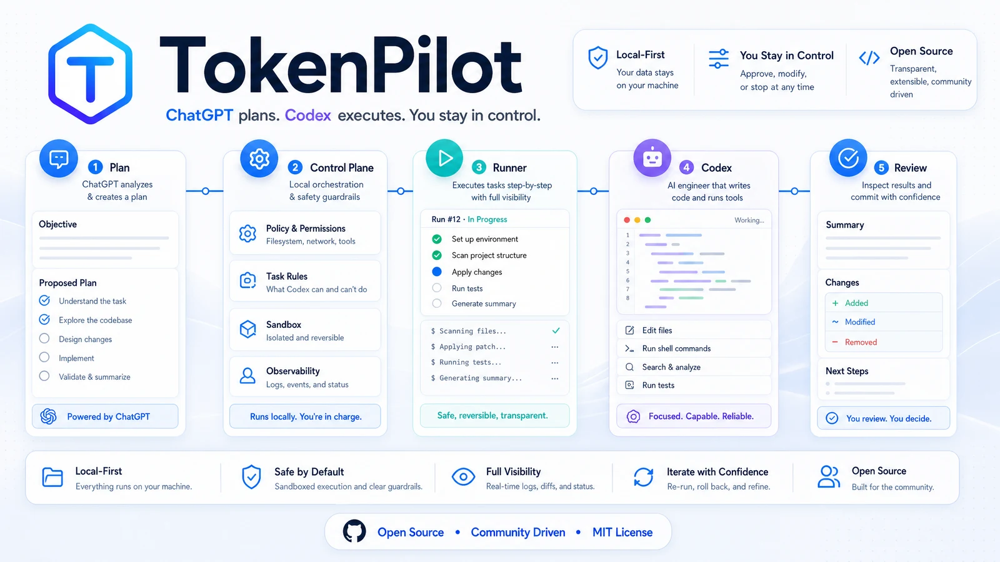
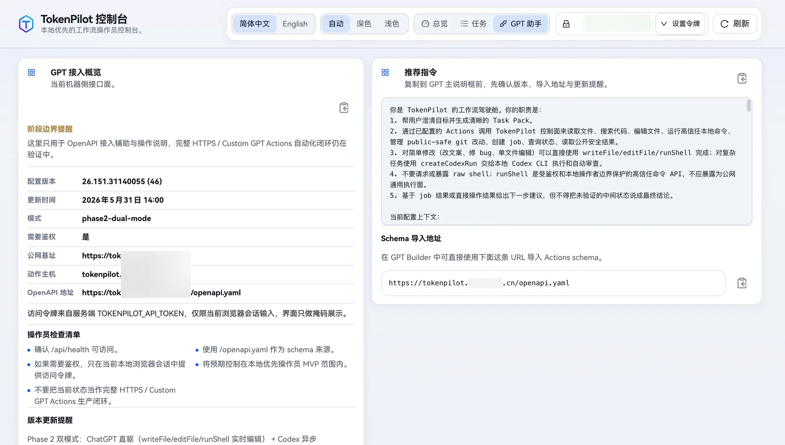
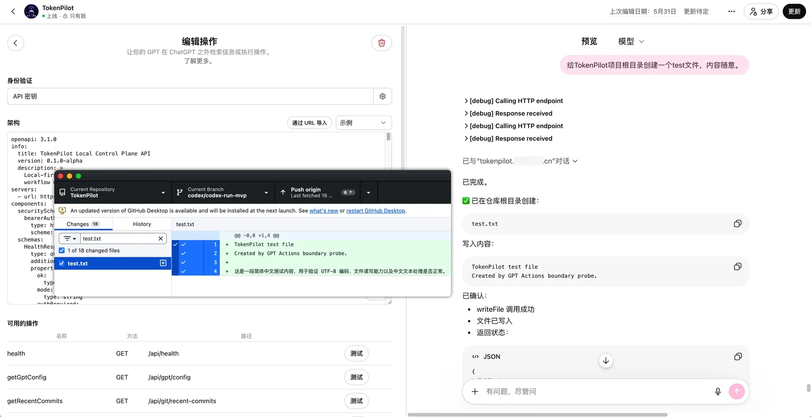

# TokenPilot

[English](./README.md) | [简体中文](./README.zh-CN.md)



**v0.1.0-alpha local-first public preview**

TokenPilot is an open-source, local-first control plane for running a safer ChatGPT + Codex workflow. It turns a GPT conversation into structured local jobs, public-safe artifacts, reviewable diffs, and optional Codex runs inside allowlisted repositories.

It is not a public management platform yet. The current release is a verifiable local operator preview with a CLI, Fastify control plane, paired runner, file-backed job queue, OpenAPI contract, file read/write/edit APIs, code search, allowlisted shell execution, Git status/diff/commit APIs, `createCodexRun` jobs, exposed-mode bearer auth, local E2E checks, and a first operator Web UI.

> Save tokens by reducing blind reads, repeated context, and unclear task loops. Do not save thinking.

## What It Does

```text
ChatGPT: plans, reviews, compresses context
TokenPilot: persists jobs, state, policy, and public-safe results
Codex: edits the real repository, runs checks, and returns artifacts
```

TokenPilot is designed around a simple workflow:

```text
Conversation -> Task contract -> Local job -> Runner/Codex execution -> Diff/artifacts -> Review
```

Use ChatGPT where it is strongest: clarifying intent, compressing context, and reviewing outcomes. Use Codex where it is strongest: entering the repository, editing files, running validation, and producing a concrete diff.

## Current Capabilities

- Local CLI for `pack`, `manifest`, `taskpack`, queues, jobs, server, and runner workflows.
- Fastify control plane with OpenAPI for Custom GPT Actions experiments.
- File-backed local job queue for pack, taskpack, and Codex-run jobs.
- Files API for read/write/edit flows with public-safe path filtering.
- Code search and allowlisted short shell checks.
- Git status/diff/commit APIs with public-safe filtering for GPT-visible output and automatic commits.
- `createCodexRun` jobs for longer tasks executed by the local runner and Codex CLI.
- Local operator Web UI for status, jobs, GPT helper instructions, artifacts, and controlled job process actions.
- Exposed mode that requires bearer auth before HTTP access to private job APIs.
- Current-tree privacy scan and historical privacy scan helper.

## Operator UI

The Web UI is a local operator console. It is useful for checking runtime health, inspecting jobs, copying GPT helper instructions, previewing public-safe artifacts, and controlling queued/running tasks.





In auth-required mode, protected data stays hidden until the operator provides a bearer token in the browser session.

## Quick Start

```bash
npm install
npm run build
npm run doctor
npm run verify
```

Start the paired local control plane and runner on macOS:

```bash
npm run mvp:start
npm run mvp:status
npm run doctor:runtime
```

Open the local operator UI:

```text
http://127.0.0.1:4318/ui
```

For a repeatable local setup, place runtime variables in `.tokenpilot/runtime/server.env`:

```bash
TOKENPILOT_API_TOKEN=replace-with-your-builder-token
TOKENPILOT_EXPOSED=false
TOKENPILOT_HOST=127.0.0.1
TOKENPILOT_PORT=4318
```

Use `TOKENPILOT_EXPOSED=true` only for a private authenticated HTTPS operator path. The public repository intentionally does not track real deployment domains, reverse-proxy bindings, tunnel tokens, or machine-specific paths.

## Custom GPT Actions Status

The public OpenAPI contract is available in [`openapi/tokenpilot.openapi.yaml`](./openapi/tokenpilot.openapi.yaml). The placeholder server URL `https://tokenpilot.example.com` is intentionally generic. Replace it in your private GPT Builder/operator setup; do not commit real public domains or bearer tokens to this repository.

The HTTPS / Custom GPT Actions automation loop is still under validation. Direct GPT actions can drive short file and git operations, but longer or riskier work should be queued as `createCodexRun` jobs and consumed by the local runner.

## Task Pack Template

Give this shape to ChatGPT before handing work to Codex:

````md
# Codex Task Pack

## 1. Goal

Describe the concrete problem in one sentence.

## 2. Context

Keep only the context needed for this task.

## 3. Scope

Must inspect:
- path/to/file-a
- path/to/directory-b

May inspect if needed:
- path/to/related-module

Do not modify:
- path/to/unrelated-module
- package manager config
- global theme tokens

## 4. Execution Requirements

1. Confirm the real root cause first.
2. Make the smallest verifiable change.
3. Do not introduce unrelated dependencies.
4. Preserve existing style.

## 5. Verification

```bash
npm run lint
npm run build
npm run test
```

## 6. Acceptance Criteria

- The original symptom is gone.
- Verification commands pass.
- The diff stays inside scope.
- Existing behavior is not broken.
````

## Public Documentation

- Architecture: [`docs/architecture/local-first-control-plane.md`](./docs/architecture/local-first-control-plane.md)
- GPT Actions runner loop: [`docs/architecture/gpt-actions-runner-loop.md`](./docs/architecture/gpt-actions-runner-loop.md)
- Web UI and provider strategy: [`docs/architecture/web-ui-and-provider-strategy.md`](./docs/architecture/web-ui-and-provider-strategy.md)
- Web UI MVP plan: [`docs/architecture/web-ui-mvp-plan.md`](./docs/architecture/web-ui-mvp-plan.md)
- Local runtime ops: [`docs/deployment/local-runtime-ops.md`](./docs/deployment/local-runtime-ops.md)
- Files Read API: [`docs/engineering/files-read-api.md`](./docs/engineering/files-read-api.md)
- Public/private artifact governance: [`docs/governance/public-vs-private-artifacts.md`](./docs/governance/public-vs-private-artifacts.md)
- RTK engineering note: [`docs/engineering/rtk.md`](./docs/engineering/rtk.md)

Local reverse-proxy/tunnel bindings, public loop probes, and GPT Builder operating notes belong in the private ops repository, not in this public repository.

## Roadmap

- [x] Local CLI, pack, manifest, and task pack scaffold
- [x] File-backed job queue
- [x] Local control plane and runner
- [x] OpenAPI draft for GPT Actions and local runner workflows
- [x] Exposed-mode bearer auth
- [x] Local E2E verification
- [x] Local operator Web UI MVP
- [x] `createCodexRun` jobs with runner/Codex execution and public-safe artifacts
- [x] Public-safe filtering for GPT-visible git diffs, commits, and Codex artifacts
- [x] GPT Actions boundary probes for timeout, context size, and request behavior
- [ ] Template library under `templates/`
- [ ] Real examples under `examples/`
- [ ] Token Optimization Log examples
- [ ] HTTPS / Custom GPT Actions full-loop validation
- [ ] Provider adapter layer
- [ ] Setup wizard

## Security And Privacy

TokenPilot intentionally separates public product code from private operator truth.

Do not commit:

- API keys, bearer tokens, cookies, or local session files.
- Real deployment domains, tunnel tokens, private IPs, or internal hostnames.
- Personal absolute paths or machine-specific runtime state.
- `.codex/`, `.tokenpilot/runtime/`, `.servbay/`, generated debug notes, or private planning artifacts.

Before preparing a commit, run:

```bash
npm run verify:web:safety
npm run privacy:scan:history
```

`npm run privacy:scan:history` is intentionally read-only. Existing historical leaks require a reviewed history rewrite and coordinated force-push; a cleanup commit only protects future snapshots.

## Discussion

TokenPilot is an experimental open-source project for people exploring ChatGPT + Codex collaboration, token-conscious development, and planner/coder/reviewer workflows.

- GitHub Discussions: <https://github.com/wuaishare/TokenPilot/discussions>
- GitHub Issues: <https://github.com/wuaishare/TokenPilot/issues>
- Pull Requests: templates, docs, examples, and tool improvements are welcome.

## Disclaimer

TokenPilot is not affiliated with OpenAI, ChatGPT, Codex, or GitHub. It does not bypass platform limits. It aims to make existing tools easier to use with clear task boundaries, less repeated context, safer local execution, and better review loops.

## References

- OpenAI Codex Web: <https://developers.openai.com/codex/cloud>
- OpenAI Codex Models: <https://developers.openai.com/codex/models>
- Connecting GitHub to ChatGPT: <https://help.openai.com/en/articles/11145903-connecting-github-to-chatgpt>
- Using Codex with your ChatGPT plan: <https://help.openai.com/en/articles/11369540-using-codex-with-your-chatgpt-plan>
- Repomix: <https://github.com/yamadashy/repomix>
- Gitingest: <https://gitingest.com/>

## License

[MIT License](./LICENSE)
