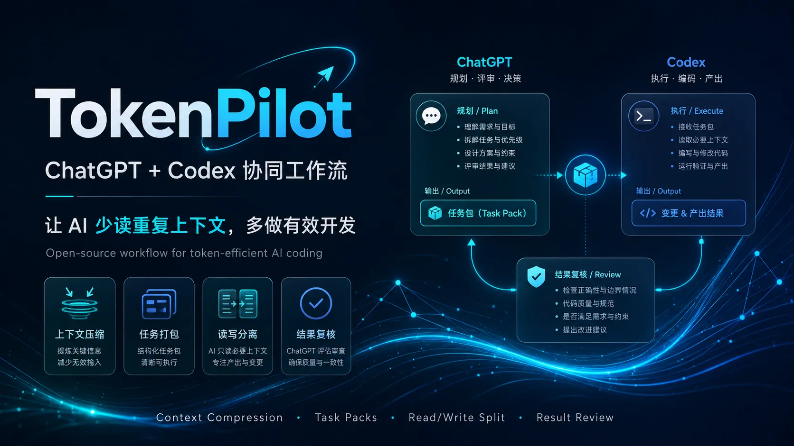
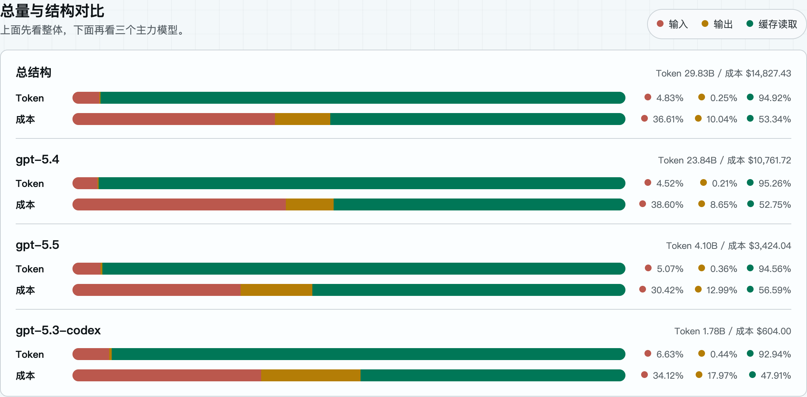

# TokenPilot




## **项目状态：v0.1.0-alpha local-first public preview**
> TokenPilot 目前仍处在探索早期，但已经不再只是概念说明。<br>
> 当前已具备 **local-first CLI / server / runner、本地 file-backed job queue、OpenAPI、Files Read API、exposed-mode auth、本地 E2E 验证，以及第一版只读 Web UI MVP**。<br>
> 当前 Web UI 是 **local-first read-only console**，用于查看运行状态、Jobs 和 GPT Helper。<br>
> **Full HTTPS / Custom GPT Actions automation loop is still under validation.**<br>
> 当前仓库可以描述为：**可验证、可继续演进的本地公开预览版本**，而不是完整 HTTPS 管理平台。<br>
> **如果你对 ChatGPT + Codex 协同开发、Token 优化、任务边界设计这类话题感兴趣，欢迎参与讨论：[GitHub Discussions](https://github.com/wuaishare/TokenPilot/discussions)。**
> 欢迎分享经验、反例和有价值的思路。

> **省 Token，不省思考。**<br>
> 用 ChatGPT 做需求澄清、上下文压缩、任务规划与结果复盘；用 Codex 进入仓库执行修改、运行验证、产出 Diff / PR。<br>
> **让 AI 少读重复上下文，多做有效开发。**
---

## TokenPilot 是什么？

**TokenPilot** 是一个探索 **ChatGPT + Codex 协同开发工作流** 的开源项目。

它的核心思路很简单：

```text
ChatGPT：规划者 / 审查者 / 上下文压缩器
TokenPilot：本地任务编排者 / 状态持久化层
Codex：执行者 / 编码者 / 验证者
```

ChatGPT 负责把问题想清楚、边界压清楚、任务写清楚；TokenPilot 负责把结构化任务落成本地 job、维护状态与结果；Codex 负责进入真实仓库执行、验证并交付产物。

TokenPilot 不是为了少用 AI，而是为了更会用 AI：

> 以人为舵，以 AI 为帆。<br>
> 先定方向，再让模型加速。

---

## 文档治理约定

公开文档按架构、部署、治理、证明材料分层维护；本地运行态和私有过程材料不进入公开仓库。<br>
边界说明见：[`docs/governance/public-vs-private-artifacts.md`](./docs/governance/public-vs-private-artifacts.md)

---

## 为什么需要它？

AI 编程很快，也很容易让人失去掌控。

很多时候，我们只是回复：

```text
继续
下一步
同意
确认
```

AI 就会开始下一轮工作。它会读更多文件、生成更多方案、继续修改代码、给出更多建议。过程很顺，但问题也在这里：

```text
你可能花掉了大量 Token；
你可能没有真正看懂它读了什么；
你可能没有确认它改了什么；
你可能在不知不觉中，把项目方向交给了模型。
```

TokenPilot 关注的不是“抠门地省 Token”，而是建立一种 **AI 编程的用量自觉和过程掌控**。

就像记账一样：<br>
不记账时，很多支出都是随手发生的；开始记账后，每一笔收入支出都变得清楚，很多冲动消费会在记录的那一刻被重新审视。

AI 编程也是一样：

```text
先记账，再消费；
先定界，再执行；
先复盘，再继续。
```

---

## 一个直观的 Token 成本比例

下面的价格表只用于帮助理解 **输入 Token、缓存输入 Token、输出 / 思考 Token** 的费用比例。价格可能变化，请以 OpenAI 官方价格页为准。

| 模型 | 输入 / 1M tokens | 缓存输入 / 1M tokens | 输出 / 1M tokens | 输出约为输入的几倍 |
|---|---:|---:|---:|---:|
| gpt-5.5 | $5.00 | $0.50 | $30.00 | 6× |
| gpt-5.4 | $2.50 | $0.25 | $15.00 | 6× |
| gpt-5.3-codex | $1.75 | $0.175 | $14.00 | 8× |

> ChatGPT / Codex 订阅套餐不是按 API 价格直接扣费，但这个比例能帮助建立成本直觉：**输出 Token 和思考 Token 往往比输入 Token 更值得重视**。

如果任务边界不清、上下文不压缩、让模型反复全仓探索，即使是高额度套餐，也可能很快被无效读取、高思考和多轮返工消耗掉。

[](./docs/proof/token-usage-report.html)

> 查看完整论证页：[`docs/proof/token-usage-report.html`](./docs/proof/token-usage-report.html)

---

## TokenPilot 解决什么问题？

### 1. 减少 Codex 盲读

不要一上来就让 Codex “全面审查整个项目”。<br>
先让 ChatGPT 整理出明确任务包：

```text
目标是什么？
应该先读哪些文件？
哪些范围不要改？
怎么验证？
什么结果才算完成？
```

Codex 不再从零探索，而是带着清晰边界执行。

### 2. 把 ChatGPT 端能力接入 Codex 工作流

Free / Plus / Pro 用户都可以用 TokenPilot。

区别只在于可用模型、额度和上下文能力不同：

```text
Free：适合轻量任务拆解和短上下文整理
Plus：适合更频繁的项目分析、任务规划和结果复盘
Pro：适合把更强模型作为高强度 Planner / Reviewer 辅助 Codex
```

TokenPilot 不绕过任何平台限制。它只是把 ChatGPT 端更适合“规划和审查”的能力，用在 Codex 执行之前和之后。

### 3. 减少“边做边猜”

当任务描述不清楚时，AI 很容易：

```text
读了很多无关文件；
改了不该改的模块；
输出看似合理但没有验证的方案；
继续给出下一步建议，却没有真正解决问题。
```

TokenPilot 要求每一次较大推进前，都先生成任务契约；每一次推进后，都进行结果复盘。

---

## 核心工作流

```text
用户提出需求
  ↓
ChatGPT：澄清目标、压缩上下文、生成结构化任务包
  ↓
TokenPilot：创建本地 job（taskpack / pack）
  ↓
Local Runner / Codex：claim job、读取关键文件、执行修改或生成产物、运行验证
  ↓
TokenPilot：持久化 job 状态与脱敏后的公开结果
  ↓
ChatGPT：审查结果、识别风险、沉淀经验
  ↓
继续下一轮明确任务
```

一句话：

> ChatGPT 谋定，TokenPilot 编排，Codex 执行。

---

## Codex Task Pack 最小模板

把下面模板交给 ChatGPT，让它根据你的问题生成可直接交给 Codex 的任务包。

```md
# Codex Task Pack

## 1. 任务目标

用一句话说明要解决什么问题。

## 2. 背景摘要

只保留当前任务必要背景，不要塞入整个项目历史。

## 3. 任务范围

### 必须检查

- path/to/file-a
- path/to/directory-b

### 必要时可以检查

- path/to/related-module

### 禁止修改

- path/to/unrelated-module
- database schema
- package manager config
- global theme tokens

## 4. 执行要求

1. 先确认真实根因。
2. 采用最小可验证改动。
3. 不引入无关依赖。
4. 不修改无关模块。
5. 保持现有代码风格。

## 5. 验证命令

```bash
npm run lint
npm run build
npm run test
```

请根据项目实际情况替换。

## 6. 验收标准

- 问题现象消失；
- 验证命令通过；
- 没有无关 diff；
- 不破坏现有功能；
- 输出修改文件列表与验证结果。

## 7. 完成后必须输出

- 根因；
- 修改文件；
- 关键改动；
- 验证结果；
- 遗留风险；
- 后续建议。
```

---

## 推荐使用方式

### 1. 建立项目上下文

为每个重要项目准备少量高密度文件：

```text
00_START_HERE.md
01_PROJECT_BRIEF.md
02_ARCHITECTURE_MAP.md
03_REPO_INDEX.md
04_CURRENT_STATUS.md
05_DECISION_LOG.md
06_TOKEN_OPTIMIZATION_LOG.md
```

这些文件不是为了替代源码，而是为了让 ChatGPT 快速理解项目，减少每次从零解释。

### 2. Codex 执行前：先生成任务包

在 ChatGPT 中输入：

```text
请把下面的问题整理成 Codex Task Pack。
要求任务边界清晰、相关文件明确、禁止修改范围明确、验收标准可执行。

问题：
<粘贴你的需求、报错或现象>
```

### 3. Codex 执行后：再做结果复盘

把 Codex 输出贴回 ChatGPT：

```text
这是 Codex 的执行结果。请帮我审查：
1. 是否真正解决原问题？
2. 是否超出任务边界？
3. 是否存在无关 diff？
4. 验证命令是否足够？
5. 是否需要继续一轮？
6. 应该沉淀哪些项目状态和决策？
```

---

## 适合什么人？

TokenPilot 适合：

- 正在使用 ChatGPT 与 Codex 的开发者；
- Free / Plus / Pro 用户；
- 经常觉得 Codex 上下文消耗太快的人；
- 维护中大型仓库、多模块项目、长期任务的人；
- 想实践 “Planner + Coder + Reviewer” 工作流的人；
- 想减少 AI 编程中的盲读、重复读、全仓读和返工的人。

不太适合：

- 一次性小脚本；
- 不需要上下文沉淀的临时任务；
- 只想找一个自动写完整项目的黑盒工具；
- 不愿意维护任务边界、项目索引和结果复盘的人。

---

## 公开文档地图

- 架构说明：[`docs/architecture/local-first-control-plane.md`](./docs/architecture/local-first-control-plane.md)
- GPT Actions 循环：[`docs/architecture/gpt-actions-runner-loop.md`](./docs/architecture/gpt-actions-runner-loop.md)
- Web UI / Provider 策略：[`docs/architecture/web-ui-and-provider-strategy.md`](./docs/architecture/web-ui-and-provider-strategy.md)
- Web UI MVP 计划：[`docs/architecture/web-ui-mvp-plan.md`](./docs/architecture/web-ui-mvp-plan.md)
- 本地运行参考：[`docs/deployment/local-runtime-ops.md`](./docs/deployment/local-runtime-ops.md)
- ServBay / frp 泛化示例：[`docs/deployment/servbay-frp-example.md`](./docs/deployment/servbay-frp-example.md)
- Files Read API：[`docs/engineering/files-read-api.md`](./docs/engineering/files-read-api.md)
- 边界治理：[`docs/governance/public-vs-private-artifacts.md`](./docs/governance/public-vs-private-artifacts.md)
- RTK 工程说明：[`docs/engineering/rtk.md`](./docs/engineering/rtk.md)

## 后续计划

- [x] 落地本地 CLI / repomix / task pack 骨架
- [x] 落地 file-backed job queue
- [x] 落地本地控制面和 runner
- [x] 写出 GPT Actions / HTTPS 控制面 / 本地 runner 的 OpenAPI 草案
- [x] 落地 exposed-mode auth
- [x] 完成本地 E2E 验证
- [x] 落地 read-only Web UI MVP
- [ ] 提供 `templates/` 模板库
- [ ] 提供真实案例 `examples/`
- [ ] 整理 Token Optimization Log
- [ ] 通过自有 HTTPS 控制面暴露异步 job API
- [ ] 接入 ChatGPT 自定义 GPT Actions
- [ ] 完成 HTTPS / Custom GPT Actions 全流程真实验证
- [ ] 实现 Provider Adapter
- [ ] 提供 Setup Wizard
- [ ] 补充 English / 繁體中文 README

---

## 当前已具备什么？

当前仓库已经可以作为 **TokenPilot 的本地实验骨架** 使用：

```bash
npm install
npm run build:web
npm run doctor
npm run pack
npm run manifest
npm run taskpack -- --title "..." --problem "..."
npm run server
npm run runner
```

如果你在验证 GPT HTTPS 远程闭环，不要只启动 control plane。
当前本地运行模型是：

```text
HTTPS / GPT Actions -> control plane -> queued jobs -> local runner consume -> terminal result
```

在 macOS 上，推荐直接使用：

```bash
npm run mvp:start
npm run mvp:status
npm run doctor:runtime
```

这样会把本地 control plane 和 paired runner 一起纳入 LaunchAgent 长跑管理，避免出现 “job 能入队，但一直停留在 queued” 的假健康状态。

如果你已经构建了前端，也可以访问只读型本地控制台：

```text
http://127.0.0.1:4318/ui
```

`v0.1.0-alpha` 当前目标不是直接把 Web UI 写成公网管理平台，而是先把下面这条本地链路跑顺：

```text
仓库源码
  ↓
repomix 打包
  ↓
bundle / manifest / prompt
  ↓
task pack
  ↓
  本地控制面 / runner
```

这意味着 TokenPilot 已经从“纯手动流程说明”进入了“可验证、可继续演进”的状态；第一版 Web UI 也只定位为 local-first read-only console。Full HTTPS / Custom GPT Actions automation loop is still under validation.

---

## 第二阶段方向

第二阶段会重点验证这条链路：

```text
ChatGPT Custom GPT Actions
  ↓
HTTPS 控制面
  ↓
本地 runner
  ↓
repomix / Task Pack / Codex 执行
```

为了安全和稳定，TokenPilot 不会让自定义 GPT 直接控制本地 shell。<br>
更合理的方式是：

1. GPT 只调用你自己的 HTTPS API
2. 控制面负责任务入队、状态查询和结果读取
3. 本地 runner 主动从控制面取任务并执行
4. 结果回传后，再由 GPT 继续对话式编排

---

## 参与讨论

TokenPilot 仍然是一个实验性开源项目。如果你正在探索 ChatGPT + Codex 协同、节省 Token 的 AI 编程工作流，欢迎参与讨论：

- 💬 GitHub Discussions：<https://github.com/wuaishare/TokenPilot/discussions>
- 🐛 GitHub Issues：<https://github.com/wuaishare/TokenPilot/issues>
- 🔀 Pull Requests：欢迎贡献模板、文档、示例和工具代码。

建议使用方式：

```text
Discussions：开放讨论、经验分享、Q&A、工作流案例
Issues：明确 bug、文档错误、可执行任务
Pull Requests：模板、文档、示例、工具代码贡献
```

---

## 免责声明

TokenPilot 是一个社区实验项目 / 开源方法论，不隶属于 OpenAI，也不是 Codex、ChatGPT 或 GitHub 的官方功能。

本项目不会帮助绕过任何平台限制。它关注的是：

```text
更合理地分配现有工具能力；
更少重复读取；
更清晰地描述任务；
更稳定地交付代码；
更系统地复盘结果。
```

---

## 参考资料

- OpenAI Codex Web
  https://developers.openai.com/codex/cloud

- OpenAI Codex Models
  https://developers.openai.com/codex/models

- Connecting GitHub to ChatGPT
  https://help.openai.com/en/articles/11145903-connecting-github-to-chatgpt

- Using Codex with your ChatGPT plan
  https://help.openai.com/en/articles/11369540-using-codex-with-your-chatgpt-plan

- 相关讨论：有人实践过“规划模型 + 编码模型”的 AI 编程工作流吗？
  https://linux.do/t/topic/2185954

- Repomix
  https://github.com/yamadashy/repomix

- Gitingest
  https://gitingest.com/

---

## License

[MIT License](./LICENSE)
